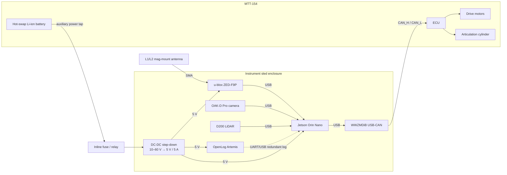

# Single-track articulated mode

In this configuration one MTT-154 pulls the instrument sled through an articulated hitch. Steering is the cylinder rate (or position, depending on `direction_mode`), and the drive code sends one 8-byte command frame per cycle at or above 5 Hz. The onboard compute lives on the sled and reaches the MTT ECU over a single CAN bus.

## Block diagram

## Connector and harness notes

A Deutsch DT 6-pin connector breaks out the MTT-154 auxiliary port. Three of the six pins carry CAN_H, CAN_L, and signal ground into the USB-CAN adapter; the remaining pins carry the switched auxiliary power and return into the inline fuse before the DC-DC converter. Keeping power and CAN in a single connector means the sled can be unplugged as one unit when the rover is parked.

The CAN run from the adapter to the ECU should be a twisted pair with a 120 Ω termination at each end, and the total stub length inside the enclosure should be kept short so the termination stays effective. The adapter sits close to the connector pass-through so the unshielded stub stays under 30 cm.

## Parts used

All items below are already in `master_parts_list.xlsx`. The references in parentheses are the spreadsheet codes.

The Jetson Orin Nano Developer Kit (E3) is the host compute. The WWZMDiB USB-CAN module (E4) bridges USB to the MTT ECU's CAN bus. Deutsch DT 6-pin connectors (E5) provide the sealed interface between sled and tractor. A wide-input DC-DC step-down (E6, 10–60 V to 5 V at 5 A) regulates the auxiliary tap down to Jetson voltage, protected by an inline fuse/relay harness (E7). The OpenLog Artemis (E8) provides a redundant data logger independent of the Jetson. Positioning comes from a u-blox ZED-F9P receiver (I3) with an L1/L2 mag-mount antenna (I4). The OAK-D Pro camera (I1) and D200 LiDAR (I2) provide vision for hazard assessment.

## Software mapping

The `SingleTrackCANBackend` in `rover_hardware.mtt154.single_track` takes a `FrameCoder` (from the gitignored vendor drivers) and a `CANInterfaceConfig` pointing at the USB-CAN adapter. On each control step the backend encodes the current CommandBus, sends it as a frame at the configured arbitration ID (defaults to 0x100), and polls for feedback frames from the ECU which are decoded into `VehicleFeedback` for the state estimator.
