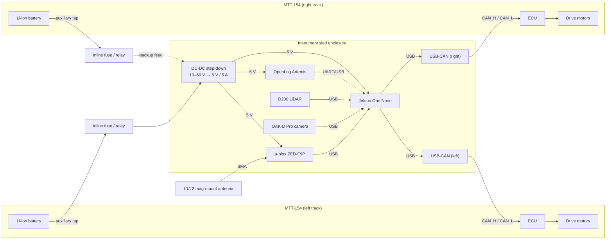

# Tank mode (two MTTs coupled side-by-side)

In tank mode two MTT-154 units are mechanically coupled and driven as the tracks of a larger vehicle. Each MTT runs its own ECU on its own CAN bus, so the onboard compute needs two independent CAN interfaces. Turning comes from the difference in commanded track velocity rather than from the articulated hitch, so the drive code sends `steer = 0` on each per-side command frame and encodes the turn entirely as asymmetric throttles.

## Block diagram

## Connector and harness notes

Each MTT brings its own Deutsch DT 6-pin connector carrying CAN_H, CAN_L, signal ground, and the switched auxiliary power rail. The two connectors land on opposite faces of the enclosure so the left and right harnesses stay separable. Power from the two auxiliary taps is diode-ORed into the DC-DC converter so that the compute keeps running if one unit's battery is swapped mid-mission — but only one bus is load-bearing at a time, so the idle tap sees close to zero current.

Each CAN bus must be independently terminated with 120 Ω at both ends. Mixing the two buses on a single adapter is not supported: the ECUs use the same arbitration IDs for command and feedback, so they must stay on physically separate buses.

## Parts used

Compared to the single-track configuration this adds a second WWZMDiB USB-CAN module (E4 ×2), a second Deutsch DT 6-pin connector (E5), and a second fuse/relay harness (E7). The compute, sensors, DC-DC converter, GNSS, and data logging stay as in the single-track build. See `master_parts_list.xlsx` for quantities.

## Software mapping

The `TankCANBackend` in `rover_hardware.mtt154.tank` wraps two `SingleTrackCANBackend` instances — one for each MTT. When the drive code calls `send(cmd)`, the tank backend runs `mix_differential(cmd, config)` to produce two per-side CommandBus instances and forwards each to its corresponding single-track backend. The mixing math is the same as the simulator's `SideBySideSkidSteer` model, so a scenario that runs cleanly in the emulator produces the same wire commands on hardware.
